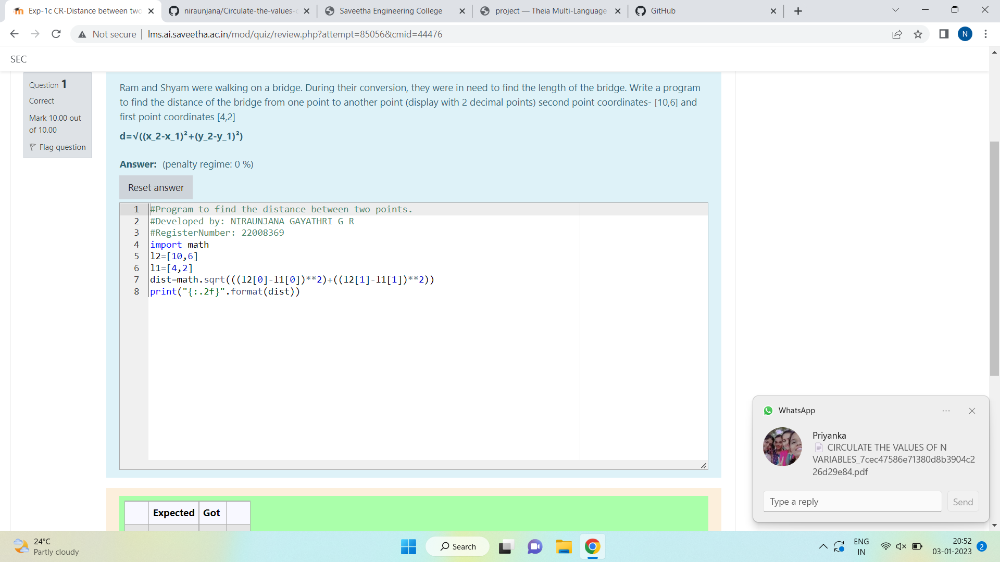

# DISTANCE-BETWEEN-TWO-POINTS

## AIM:
To write a python program to find the distance two 2 points
## ALGORITHM:
### Step 1: 
import math
### Step 2: 
list the elements in array
### Step 3: 
Subtitute the values in the distance formula
### Step 4: 
print the distance using formula
### Step 5: 
End the program
### PROGRAM:
```python
#Program to find the distance between two points.
#Developed by: NIRAUNJANA GAYATHRI G R
#RegisterNumber: 22008369
import math
l2=[10,6]
l1=[4,2]
dist=math.sqrt(((l2[0]-l1[0])**2)+((l2[1]-l1[1])**2))
print("{:.2f}".format(dist))
```
### OUTPUT:



### RESULT:
Thus the distance between the two points are successfully executed.
